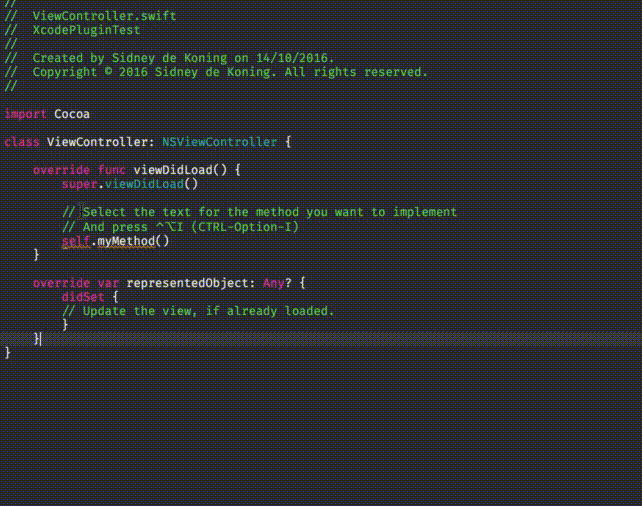
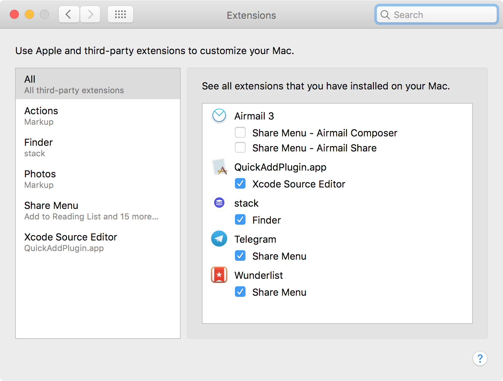
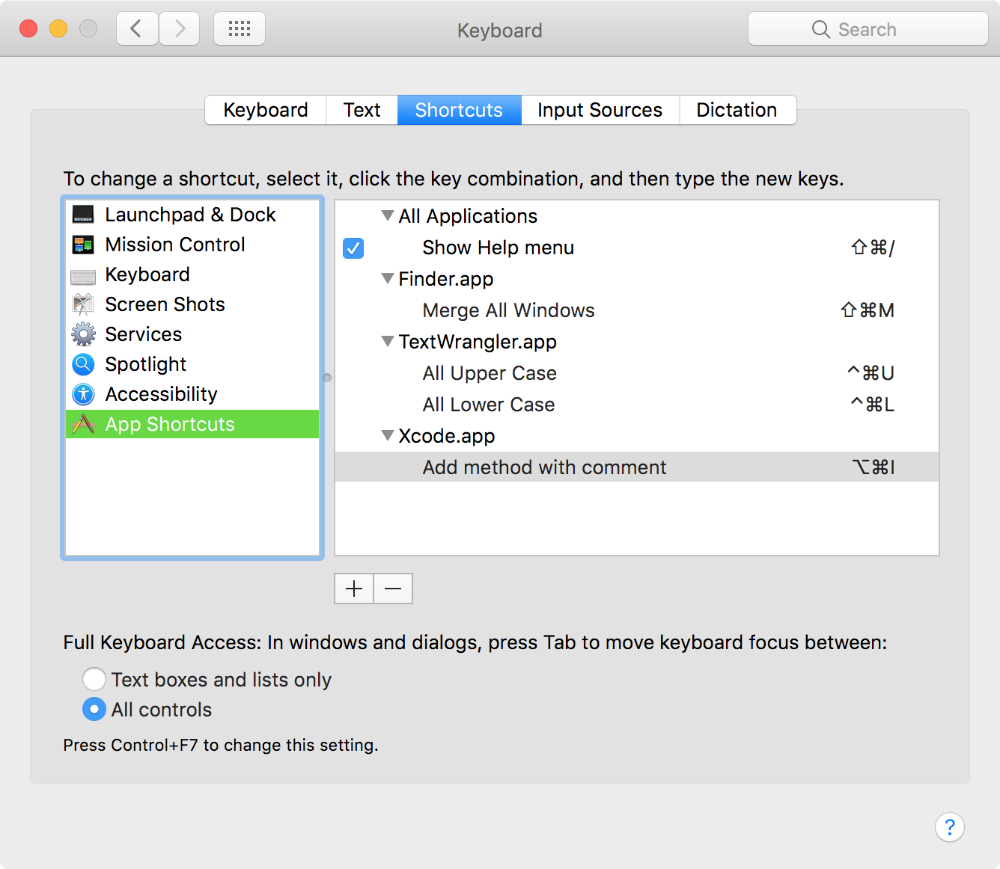

# Quick Add

[] (https://github.com/funky-monkey/QuickAdd) 
![Swift Version] (https://img.shields.io/badge/swift-3.0-orange.svg?style=flat)

A Xcode Source Editor Extension to quickly add a method implementation _with_ comment from selected text

### Why? 
Xcode was lacking a way to quickly add a method. So I created it.

### Installation Guide (Xcode 8 / OSX 10.11+)

1. download the [Quick Add app](https://github.com/funky-monkey/QuickAdd/blob/master/release/QuickAddPlugin.zip)
2. unzip and copy to Applications folder
3. Run (right click + open)
4.  System Preferences ⇒ Extensions ⇒ All ⇒ QuickAddPlugin. (See image 1 below.)
5.  System Preferences ⇒ Keyboard ⇒ Shortcuts. Add Shortcut `⌥⌘i` for `Add method with comment`. (See image 2 below.)
6. open Xcode
7. Select any Swift source file
8. check if `Editor -> Quick Add` is there 

 
**Image 1:**

 
**Image 2:**

### Usage
Select the text you want to add an method implementation of, press `⌥⌘i` and presto! A full method implementation!

### Supported languages
- Swift (for now)
